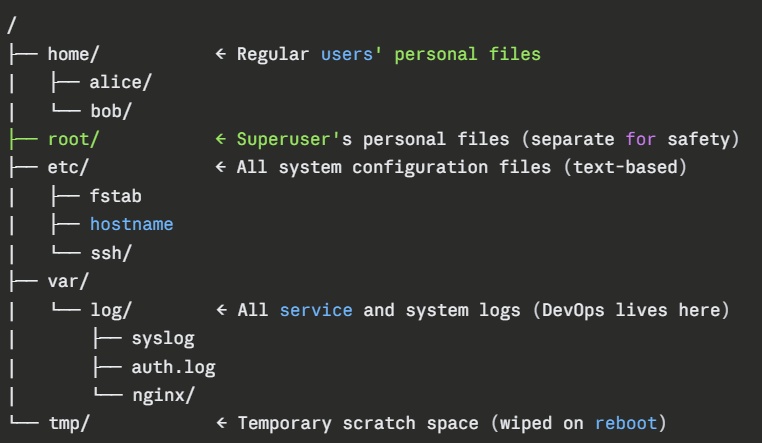
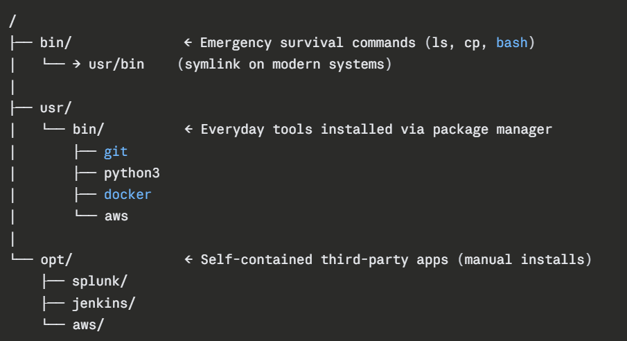

# Day 07 – Linux File System Hierarchy & Scenario-Based Practice


### *Part 1: Linux File System Hierarchy*

- `/` : Root Directory
    - The top of the entire filesystem tree. 
    - Every single file, folder, and device on the system lives under this. 
    - There is only one root on a Linux system.

- `/home` : User Home Directories
    - Every regular user gets their own folder here. 
    - Personal files, shell configs, downloads — all live here. 
    - On AWS EC2, the default user is ec2-user or ubuntu, so their home is /home/ec2-user or /home/ubuntu.

- `/root` : Root User's Home
    - The superuser (root)'s personal home directory. 
    - It is deliberately kept separate from /home for security — even if /home is on a broken/unmounted disk, root can still log in and fix things.
    
- `/etc` : Configuration Files
    - The brain of the system. 
    - All system-wide configuration files live here — no binaries, just plain text config files. 
    - If you want to change how any service or system behaves, you come here.

- `/var/log` : Log files
    - var stands for variable data — files that constantly grow and change. 
    - /var/log is where every service writes its logs. 
    - Very Usefull for Debugging issues.

- `/tmp` : Temporary Files
    - A scratch space for temporary files. 
    - Any user or process can write here. 
    - Files here are automatically deleted on reboot (or sometimes after a few days). 
    - Never store anything important here.
    - ⚠️ A common **security concern** — `/tmp` is world-writable, so on production servers it's often mounted with `noexec` in `/etc/fstab` to prevent attackers from running malicious scripts from here.

### - *Image Representation of File System Hierarchy :*

 


#### - *Additional Directories*

- `/bin` : Essential Command Binaries
    - Contains core system commands that are available to all users 
    - Needed even in single-user/recovery mode (when the system is barely running). 
    - EX : bash  cat  cp  df  echo  grep  ls  mkdir  mount  mv  ps  rm  sh  touch  uname ....
    - Even when your system is broken and boots into recovery mode `/bin` commands still work — that's the whole point

- `/usr/bin` : User Command Binaries
    - Contains non-essential but commonly used commands and programs installed for general use. 
    - This is the largest bin directory on any Linux system. 
    - Unlike /bin, these are not needed for basic boot/recovery — but needed for normal day-to-day work.
    - git  python3  wget  curl  vim  nano  ssh  top  htop  ansible  docker  aws  zip  unzip ....

- `/opt` : Optional / Third-Party Applications
    - Used for manually installed third-party software that doesn't follow the standard Linux directory structure. 
    - When a software vendor ships a self-contained application, it goes here. 
    - Each app gets its own subdirectory so nothing conflicts with system packages.


### - *Image Representation of Additional File System Hierarchy :*




---
### - *Part 2: Scenario-Based Practice (40 minutes)*
---

*Scenario 1: Service Not Starting*

```
A web application service called 'myapp' failed to start after a server reboot.
What commands would you run to diagnose the issue?
Write at least 4 commands in order.
```


- Step 1 : `systemctl status myapp`

- Step 2 : `journalctl -u myapp -n 20` to see What do the logs say? Then

    *If it shows stopped* 
    - Step 3 : `systemctl start myapp`


- We will also look for `systemctl is-active myapp` and `systemctl is-enabled myapp`

    *If it shows disabled*
    - Step 3 : `systemctl enable myapp`

    *If it shows in-active*
    - Step 3 : `systemctl start myapp`


- *If service not found*    
    - `systemctl list-units --type=service` : will show all the active service and hence we can find `myapp` status

    - To filter it more we can add  &nbsp; `| grep myapp` &nbsp;&nbsp;  Output : ***Empty** if service is not active* 
    
     

*Scenario 2: High CPU Usage*

```
Your manager reports that the application server is slow.
You SSH into the server. What commands would you run to identify
which process is using high CPU?
```


- Step 1 : `top` this will show sorted information about the processes
    - we can see which process is using high CPU

- Step 2 : `htop` this will show same thing but in visual highlights.

- Step 3 : `ps aux --sort=-%cpu | head -10` this will give the top 10 prcoesses in decending order of CPU Usage
    - we can note down the PID of the unintended task/process and kill it to make the system fast


*Scenario 3: Finding Service Logs*

```
A developer asks: "Where are the logs for the 'docker' service?"
The service is managed by systemd.
What commands would you use?
```

- Step 1 : `systemctl status docker` we will check service's status first
    - to check weather the service is running fine or not

- Step 2 : `journalctl -u docker -n 10` to see recent logs 
    - to check if any problem occured recently or not

- Step 3 : `journalctl -u docker -f` to follow the logs in realtime
    - to see what is happening in realtime


*Scenario 4: File Permissions Issue*

```
A script at /home/user/backup.sh is not executing.
When you run it: ./backup.sh
You get: "Permission denied"

What commands would you use to fix this?
```

- Step 1 : `ls -l /home/user/backup.sh` 
    - to check all the permissions , as for .sh files file execution permissions are needed

- Step 2 : `chmod +x backup.sh` it will give file execution permission to everyone (User , group , others) or we can simple do `chmod 764 backup.sh` to give execution permission to user only
    - To add execution permission to file

- Step 3 : `ls -l /home/user/backup.sh`  to verify that the file now has execution permission
    
- Step 4 : Try running it again using `./backup.sh` command
    - It runs successfully now
    


