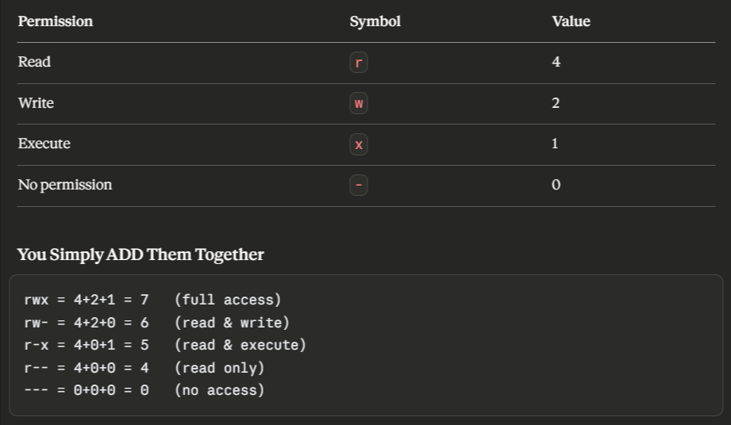

# Day 10 – File Permissions & File Operations Challenge

## Task :  *Master file permissions and basic file operations in Linux.*

## Files Created
- `Devops.txt` created using `touch Devops.txt`
- `notes.txt` created using `cat notes.txt` ---> it opens an input area where you can just type whatever you want and press `ctrl + D` to save it
- `notes.txt` can also be made using `echo "Hello" > notes.txt` it'll overwrite the existing data in the file or `echo " World" >> notes.txt` to append it in the file
- `script.sh` created using `vim script.sh` it will open a text editor press i and you will go into an insert mode and type scripts to run like `echo "hello"` or anything
- change permission of `script.sh` to excecutable for owner by using `chmod 764 script.sh` then
- `./script.sh` will run the scripts inside this file    
- `-rwxrw-r-- 1 ubuntu ubuntu 33 Apr  9 12:47 script.sh` permissions for script.sh

## Permission Changes
[before/after for each file]

## - `r` = read (4), `w` = write (2), `x` = execute (1)

---
---

*Permissions of files that we created and modified*

- `-rw-rw-r-- 1 ubuntu ubuntu 37 Apr  9 12:45 Devops.txt`
    - It's a file : Owner can read and write : Group member can also read and write : Others can only read
- `-r--r--r-- 1 ubuntu ubuntu   37 Apr  9 12:45 Devops.txt`
    - Now Everyone (Owner , Group , Other-User) can only read this file , no-one can edit or execute this file

- `-rw-rw-r-- 1 ubuntu ubuntu 44 Apr  9 12:46 notes.txt`
    - It's a file : Owner can read and write : Group member can also read and write : Others can only read    
- `-rw-r----- 1 ubuntu ubuntu   44 Apr  9 12:46 notes.txt` 
    - Now only Owner can read and write : Group can only read : other can't do anything

- `-rwxrw-r-- 1 ubuntu ubuntu 33 Apr  9 12:47 script.sh`
    - It's a file : Owner can read , write and execute : Group member can read and write : Others can only read

---
### Task : Testing Permissions

- When writing a read-only file You'll get this error : 
    - *W10: Warning: Changing a readonly* 
- When execute a non-executable file You'll get this error : 
    - *-bash: ./script.sh: Permission denied* 

---
## Commands Used

- `cat notes.txt` : it will open an input area where you can just type whatever you want and press `ctrl + D` to save it
- `cat /etc/passwd | head` : will show first 10 lines of `cat /etc/passwd` 
- `cat /etc/passwd | head -n 5` : will show only first 5 lines 
- `cat /etc/passwd | tail` : will show 10 lines from last of `cat /etc/passwd`
- `cat /etc/passwd | tail -n 8` : will show only last 8 lines
- `chmod +x script.sh` : gives execute permission to everyone
- `chmod -w script.sh` : removes writing permission to everyone

## What I Learned

- I learned a shortcut/trick to learn file permissions ; like read -> 4  , write -> 2 , execute -> 1 , and 0 means none

- Also I learned that we can give/remove read/write/execute for all user at once by using `chmod +x file_name` or `chmod -w file_name`

- I learned how to make a file using cat command , lile `cat > file_name` and you can write anything and save it by pressing `ctrl+D`

