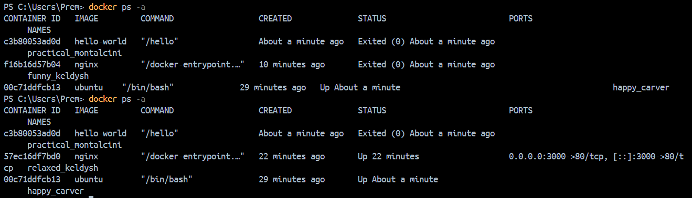

# Day 29 – Introduction to Docker

## Task
Today's goal is to **understand what Docker is and run our first container**.

We will:
- Learn why containers exist and how they differ from VMs
- Install Docker on our machine
- Run and explore containers from Docker Hub

---

### What is Docker?

- What is a container and why do we need them?
    - A container is a lightweight, isolated package that bundles our application along with everything it needs to run — code, runtime, libraries, and config — so it runs the same way on any machine.
    - Containers solves the problem : "It works on my machine but not on the server."  by locking the environment itself, not just the code.

- Containers vs Virtual Machines — what's the real difference?
    - A VM virtualizes the entire hardware and runs a full OS on top of it. A Container shares the host OS kernel and only isolates the application layer.
    - Result: Containers are faster to start, lighter on resources, and more portable than VMs.

- What is the Docker architecture? (daemon, client, images, containers, registry)
    - Visual Representation of Docker Architecture : 
    ```bash
    User (CLI)          Docker Host              Registry
    ┌────────┐         ┌──────────────────────┐   ┌─────────────┐
    │ Docker │──cmd──▶ │ Docker Daemon        │   │ Docker Hub  │
    │ Client │         │  ┌────────────────┐  │◀──│ (or private)│
    └────────┘         │  │ Images         │  │   └─────────────┘
                       │  │ Containers     │  │
                       │  └────────────────┘  │
                       └──────────────────────┘
    ```    
---

### Install Docker
1. Install Docker on your machine (or use a cloud instance)
2. Verify the installation
3. Run the `hello-world` container
4. Read the output carefully — it explains what just happened

- After running `docker run hello-world` on docker desktop that I installed on my machine , I got the following output: 

    ```
    Hello from Docker!
    This message shows that your installation appears to be working correctly.

    To generate this message, Docker took the following steps:
     1. The Docker client contacted the Docker daemon.
     2. The Docker daemon pulled the "hello-world" image from the Docker Hub.
        (amd64)
     3. The Docker daemon created a new container from that image which runs the
        executable that produces the output you are currently reading.
     4. The Docker daemon streamed that output to the Docker client, which sent it
        to your terminal.

    ```

---

### Run Real Containers
1. Run an **Nginx** container and access it in your browser
    - `docker run -d -p 3000:80 nginx` , and nginx start running on `localhost:3000`

2. Run an **Ubuntu** container in interactive mode — explore it like a mini Linux machine
    - `docker run -it ubuntu` , runs an ubuntu bash that we can use like a mini linux machine 

3. List all running containers
    - `docker ps` lists all running containers only

4. List all containers (including stopped ones)
    - `docker ps -a` lists all containers no matter it is running or not 

5. Stop and remove a container
    - `docker stop <container_id>` and then `docker rm <container_id>`  , we have to stop the running container first and only then we can remove/delete it  


---

### Explore
1. Run a container in **detached mode** — what's different?
    - `docker run -d image_name` : Detached Mode Runs container in the background, terminal stays free
    - Without `-d` , container logs flood our terminal and stops when you Ctrl+C

2. Give a container a custom **name**
    - `docker run --name <container_name> -d image_name` : Without it , Docker assigns a random name like quirky_tesla
    
3. Map a **port** from the container to your host
    - `docker run -p 3000:80 nginx`
        ```bash
        docker run -p 3000:80 nginx
        #              ↑    ↑
        #           host  container
        ``` 
    - Forwards localhost:3000 on our machine to port 80 inside the container.

4. Check **logs** of a running container
    - `docker logs <container_id>` : Show all the logs of the following container
    - `docker logs myapp` : We can run the command using container name too
    - `docker logs -f myapp` :  -f = follow/live logs
    
5. Run a command **inside** a running container
    - `-it` --> interactive + TTY (teletype) , We can use sh instead of bash if bash isn't available.         
        ```
        docker exec -it myapp bash
        #            ↑
        #       interactive terminal 
        ```

--- 

## Running Containers 

