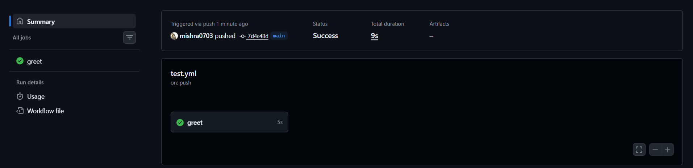
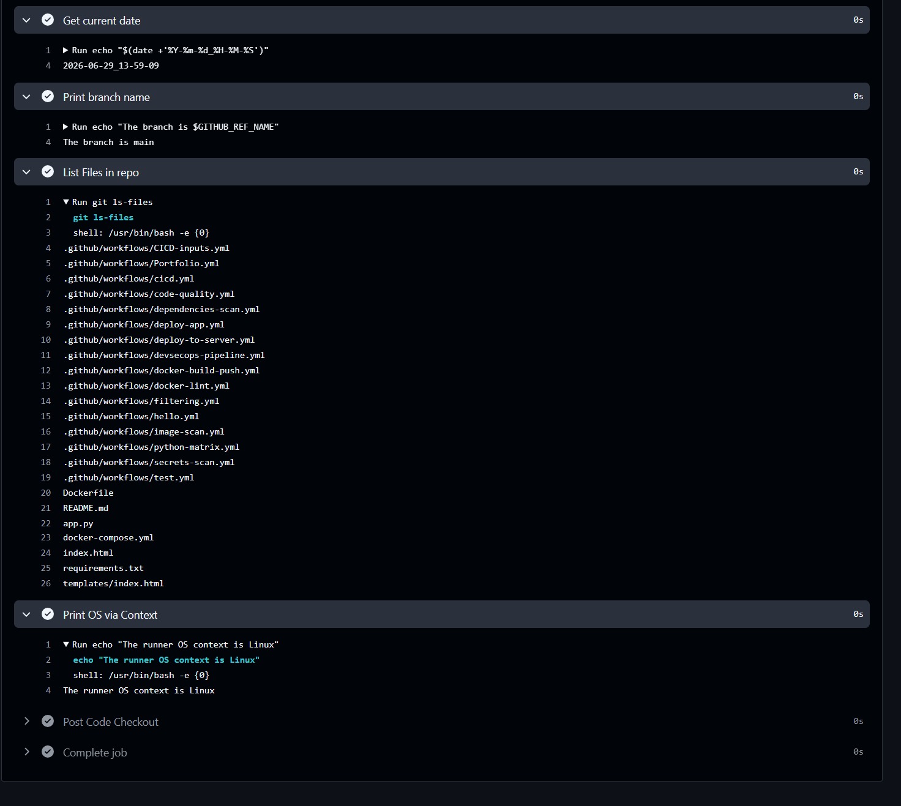

# Day 40 – Our First GitHub Actions Workflow

## Task
Today we will write our **first GitHub Actions pipeline** and watch it run in the cloud. This is the moment CI/CD stops being a concept and becomes real.

---

## Set Up

1. Create a new **public** GitHub repository called `github-actions-practice`
2. Clone it locally
3. Create the folder structure: `.github/workflows/`

My setup : https://github.com/mishra0703/githubActions/

---

## Hello Workflow

Create `.github/workflows/hello.yml` with a workflow that:
1. Triggers on every `push`
2. Has one job called `greet`
3. Runs on `ubuntu-latest`
4. Has two steps:
   - Step 1: Check out the code using `actions/checkout`
   - Step 2: Print `Hello from GitHub Actions!`

Push it. Go to the **Actions** tab on GitHub and watch it run.

**Verify:** Is it green? Click into the job and read every step.

---

## Understand the Anatomy

- `on` :  Defines the trigger(s) for the workflow. Here it's push, meaning this workflow runs every time someone pushes a commit (to any branch, since no branch filter is specified).

- `jobs` :  The top-level container for all jobs in this workflow. Everything that actually runs lives under here.

- `runs-on` :  Specifies the Runner , the type of machine that will execute this job. ubuntu-latest means GitHub spins up a fresh Ubuntu VM for this job.

- `steps` :   The ordered list of steps inside a job. Each `-` under steps is one step, executed top to bottom.

- `uses` :   Tells a step to run a pre-built, reusable Action (someone else's packaged code) instead of a raw shell command. For example `actions/checkout@v4` is GitHub's official action that pulls our repo's code onto the runner.

- `run` :   Tells a step to execute a raw shell command directly on the runner, as if we typed it in a terminal.

- `name (on a step)` :  A human-readable label for that step, shown in the GitHub Actions UI logs. Purely cosmetic and it doesn't affect execution , but makes debugging way easier when we have 10 steps and one fails.

---

## Add More Steps

Update `hello.yml` to also:

1. Print the current date and time
2. Print the name of the branch that triggered the run (hint: GitHub provides this as a variable)
3. List the files in the repo
4. Print the runner's operating system

---

## Break It On Purpose

1. Add a step that runs a command that will **fail** (e.g., `exit 1` or a misspelled command)
2. Push and observe what happens in the Actions tab
3. Fix it and push again

Write in your notes: What does a failed pipeline look like? How do you read the error?

### How does a failed pipeline look like ? 

- In the Actions tab, the workflow run shows a `red` instead of a `green` checkmark next to the commit.
- Each job in that run also shows `red` if it failed (other jobs can still be `green` if they didn't depend on the failed one).
- Inside a job, we can see a list of steps — all the steps before the failure show `green` , the failing step shows `red`, and every step after it is skipped (greyed out), because the job stops on first failure by default.
- Commit itself gets a `red` status check, which (if branch protection is on) blocks merging until it's fixed.

### How can we read the error ? 

- Click into the failed run → click the failed job → click the failed step. This expands the live log output for exactly that command.

- Read from the bottom up first — the last few lines usually contain the actual error message (e.g. Error: Cannot find module 'express', exit code 1, permission denied). Logs above that are just the buildup of normal output.

---
