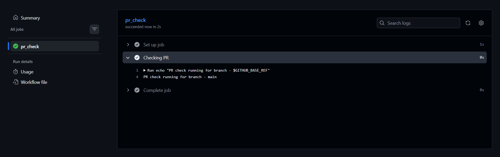
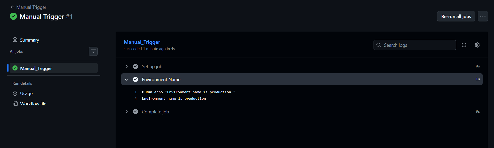
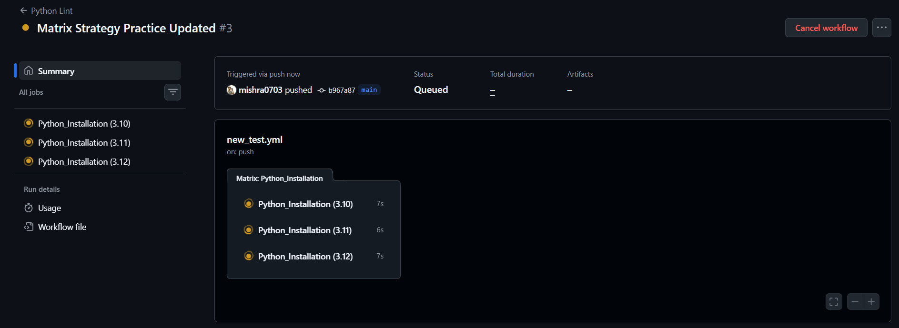
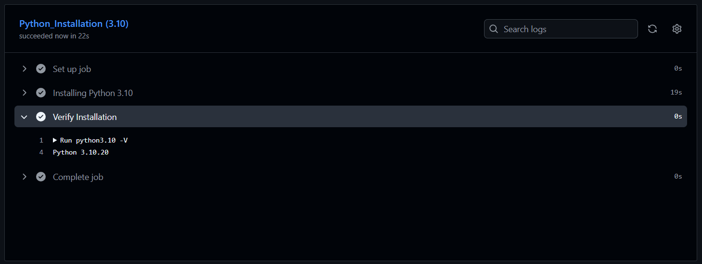
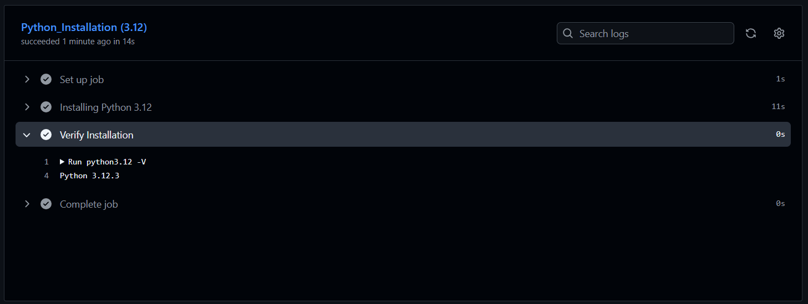
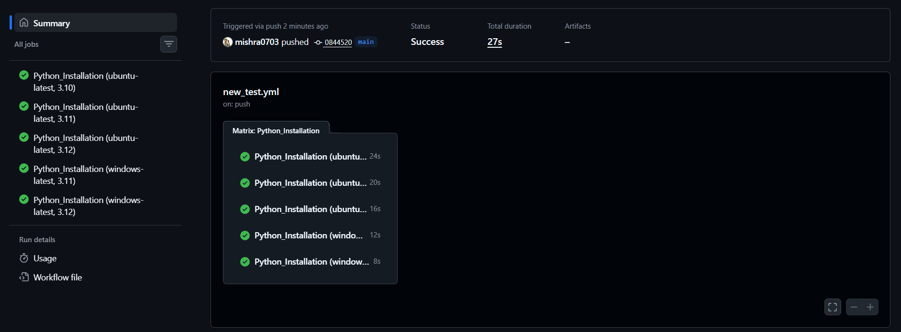
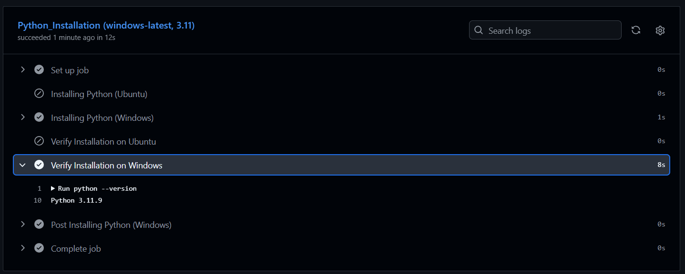

# Day 41 – Triggers & Matrix Builds

## Task
Our pipeline runs on push. Today we will learn **every way to trigger a workflow** and how to run jobs across multiple environments at once.

---

## Trigger on Pull Request

1. Create `.github/workflows/pr-check.yml`
2. Trigger it only when a pull request is **opened or updated** against `main`
3. Add a step that prints: `PR check running for branch: <branch name>`
4. Create a new branch, push a commit, and open a PR
5. Watch the workflow run automatically

**Verify:** Does it show up on the PR page?

---

## Scheduled Trigger

1. Add a `schedule:` trigger to any workflow using cron syntax
2. Set it to run every day at midnight UTC
3. Write in your notes: What is the cron expression for every Monday at 9 AM?
   - This means the workflow will be trigger at 9 am on every monday `0 9 * * 1`

*A few practical notes worth keeping in your CI/CD reference doc :*

- Minimum interval is every 5 minutes — anything more frequent isn't supported (Like every 1,2,3 or 4 mins not possible).

- Scheduled workflows only trigger from the default branch (usually main) — pushing the workflow file to a feature branch won't activate the schedule.

- GitHub doesn't guarantee exact timing during high load — it can be delayed by a few minutes.

- If the repo has been inactive for 60+ days, scheduled workflows are automatically disabled until someone pushes again.

- You can have multiple cron: entries under schedule: if you want different times (e.g. one for weekdays at 9am, one for weekends at noon).

---

## Manual Trigger

1. Create `.github/workflows/manual.yml` with a `workflow_dispatch:` trigger
2. Add an **input** that asks for an `environment` name (staging/production)
3. Print the input value in a step
4. Go to the **Actions** tab → find the workflow → click **Run workflow**

**Verify:** Can you trigger it manually and see your input printed?

---

## Matrix Builds

1. Uses a matrix strategy to run the same job across:
   - Python versions: `3.10`, `3.11`, `3.12`
2. Each job installs Python and prints the version
3. Watch all 3 run in parallel

Then extend the matrix too and also include 2 operating systems — how many total jobs run now?

---

## Exclude & Fail-Fast

1. In your matrix, **exclude** one specific combination (e.g., Python 3.10 on Windows)
2. Set `fail-fast: false` — trigger a failure in one job and observe what happens to the rest
3. Write in your notes: What does `fail-fast: true` (the default) do vs `false`?

### Difference b/w fail-fast: false and fail-fast: true : 

- `fail-fast : true` (default) — If any one matrix job fails, GitHub immediately cancels all other still-running matrix jobs, even ones that would've passed. Fast feedback, but you don't see the full picture.

- `fail-fast: false` — Every matrix job runs to completion independently, regardless of siblings failing. Slower, but you see all results — useful when you want to know exactly which combinations (OS, version, etc.) actually break.

