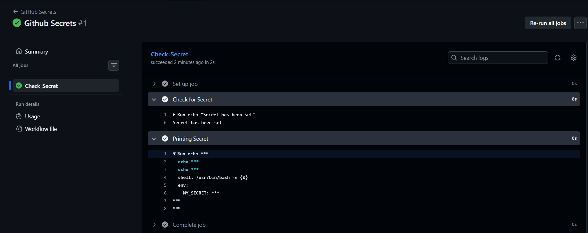
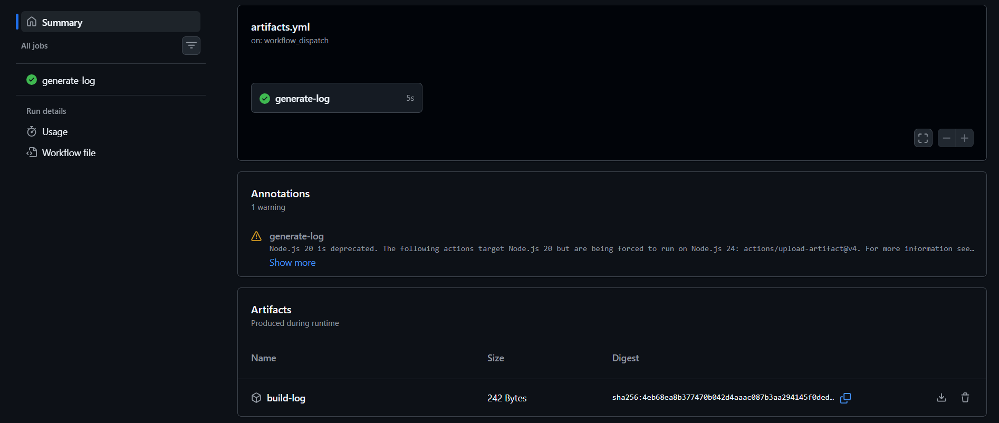

# Day 44 – Secrets, Artifacts & Running Real Tests in CI

## Task
Today our pipeline starts doing **real work** — storing sensitive values securely, saving build outputs, and running actual tests from our previous days.

---

## GitHub Secrets

1. Go to your repo → Settings → Secrets and Variables → Actions
2. Create a secret called `MY_SECRET_MESSAGE`
3. Create a workflow that reads it and prints: `The secret is set: true` (never print the actual value)
4. Try to print `${{ secrets.MY_SECRET_MESSAGE }}` directly — what does GitHub show?


### Ans to Point no. 4

- GitHub Actions masks any value that matches a registered secret. So instead of the real value, our log shows : `***`
- Masking is a safety net, not a guarantee. As it is a simple string match, not real security — it's easy to defeat accidentally or on purpose:


### Why should you never print secrets in CI logs?

- `Logs are often not fully private` — visible to anyone with repo read access, and sometimes cached, exported, or shipped to third-party log aggregators.

- `Logs persist` — stored for weeks/months, downloadable as artifacts, potentially indexed or backed up outside GitHub's control.

- `Secrets leak through indirect paths too` — error messages, stack traces, debug/verbose flags (set -x in bash) can accidentally dump env vars containing secrets.

- `Compliance risk` — leaking credentials, API keys, or tokens in CI can violate security policies (SOC2, ISO27001) and client contracts.




---

## Use Secrets as Environment Variables

1. Pass a secret to a step as an environment variable
2. Use it in a shell command without ever hardcoding it
3. Add `DOCKER_USERNAME` and `DOCKER_TOKEN` as secrets (you'll need these on Day 45)


---

## Upload Artifacts

1. Create a step that generates a file — e.g., a test report or a log file
2. Use `actions/upload-artifact` to save it
3. After the workflow runs, download the artifact from the Actions tab





---

## Download Artifacts Between Jobs

1. Job 1: generate a file and upload it as an artifact
2. Job 2: download the artifact from Job 1 and use it (print its contents)


### When would you use artifacts in a real pipeline?

- Passing build output between jobs — e.g., build job compiles code/creates a Docker image tarball, deploy job downloads and deploys it (since jobs run on isolated runners with no shared filesystem).

- Debugging failed runs — logs, stack traces, or dumps that help you diagnose an issue without re-running the pipeline.

- Compiled binaries / packaged apps — .jar, .whl, .zip, .exe, mobile app builds (.apk/.ipa) — so you have a downloadable, versioned output of each run.

- Static site / docs builds — generated HTML/docs that get uploaded and later deployed (e.g., to GitHub Pages) in a separate job.

- Sharing data across matrix jobs — e.g., each matrix job produces partial results, and a final job downloads all of them to merge/aggregate.


---

## Run Real Tests in CI

Take any script from your earlier days (Python or Shell) and run it in CI:
1. Add your script to the `github-actions-practice` repo
2. Write a workflow that:
   - Checks out the code
   - Installs any dependencies needed
   - Runs the script
   - Fails the pipeline if the script exits with a non-zero code
3. Intentionally break the script — verify the pipeline goes red
4. Fix it — verify it goes green again


---

## Caching

1. Add `actions/cache` to a workflow that installs dependencies
2. Run it twice — observe the time difference
3. Write in your notes: What is being cached and where is it stored?


  


### What is being cached and where is it stored?

GitHub is caching the pip cache directory, or we can say it caches :
- Downloaded wheel files (*.whl)
- Downloaded source distributions (*.tar.gz)
- Package metadata
- HTTP download cache

*Everythin that is in `~/.cache/pip` directory*

**Without cache**
```bash
Internet
     ↓
Download package
     ↓
Install package
```


**With cache**
```bash
GitHub Cache
     ↓
Restore ~/.cache/pip
     ↓
pip finds wheels locally
     ↓
Install package
```

*Installation still happens every run. Downloading is skipped.*


### Cache is stored at : `/home/runner/.cache/pip` Inside the Ubuntu runner 


## Complete Flow of Using Cache 

```bash
requirements.txt
        │
        ▼
pip install -r requirements.txt
        │
        ▼
Downloads packages from PyPI
        │
        ▼
Stores downloaded files in

/home/runner/.cache/pip
        │
        ▼
actions/cache uploads that folder
        │
        ▼
GitHub Cache Storage
        │
──────────────────────────────
        │
Next workflow run
        │
        ▼
actions/cache restores

/home/runner/.cache/pip
        │
        ▼
pip install
        │
        ▼
Uses cached wheel files
        │
        ▼
Installs packages much faster
```