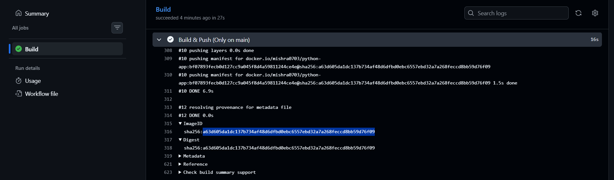

# Day 45 – Docker Build & Push in GitHub Actions

## Task
Today we will build a **complete CI/CD pipeline** — code pushed to GitHub automatically builds a Docker image and ships it to Docker Hub. No manual steps.

This is exactly what happens in real production pipelines.

---

## Build the Docker Image in CI

Create `.github/workflows/docker-publish.yml` that:
1. Triggers on push to `main`
2. Checks out the code
3. Builds the Docker image and tags it


---

## Push to Docker Hub

Add steps to:
1. Log in to Docker Hub using your secrets
2. Tag the image as `username/repo:latest` and also `username/repo:sha-<short-commit-hash>`
3. Push both tags


---

## Only Push on Main

Add a condition so the push step only runs on the `main` branch — not on feature branches or PRs.

Test it: push to a feature branch and verify the image is built but NOT pushed.





---

## Add a Status Badge

1. Get the badge URL for your `docker-publish` workflow from the Actions tab
2. Add it to your `README.md`
3. Push — the badge should show green


[](https://github.com/mishra0703/githubActions/actions/workflows/docker-publish.yml)

---

## Pull and Run It

1. On your local machine (or a cloud server), pull the image you just pushed
2. Run it
3. Confirm it works


### What is the full journey from `git push` to a running container?

```bash
Local → Remote

git push sends your commits to GitHub


Trigger

GitHub detects the push event, checks .github/workflows/*.yml for matching on-push triggers
Matching workflow(s) get queued.


Runner Provisioning

GitHub spins up a fresh VM (ubuntu-latest, etc.) — the "runner" — with a clean environment.


Checkout

actions/checkout@v4 pulls your repos code onto the runner.


Build

docker/build-push-action (or docker build) reads your Dockerfile, builds image layers, tags the image (e.g. latest, sha-<hash>).


Authenticate

docker/login-action logs the runner into Docker Hub (or GHCR/ECR) using stored secrets.


Push to Registry

If on main (per your if: condition), the built image is pushed to Docker Hub under your tags.
Image now lives in the registry, publicly/privately pullable.


Deploy Trigger

This can happen a few ways:

Manual: you SSH into a server and run docker pull + docker run.
Automated: a deploy step in the same workflow SSHes into your EC2/server and runs docker compose pull && docker compose up -d.
Webhook/CD tool: a separate service (Watchtower, ArgoCD, etc.) detects the new image and redeploys.


Pull on Server

The target server (e.g. your EC2 instance) runs docker pull username/repo:latest to fetch the new image.


Container Restart

Old container is stopped/removed (docker compose down or --remove-orphans).
New container starts from the freshly pulled image (docker compose up -d).


Running

App is live with the new code. Health checks (if configured) confirm its serving traffic correctly.
```


*In Short :* `git push` → GitHub Actions triggers → Runner checks out code → Docker builds image → logs into registry → pushes tagged image (only if `main`) → server pulls new image → old container swapped for new → app is live.