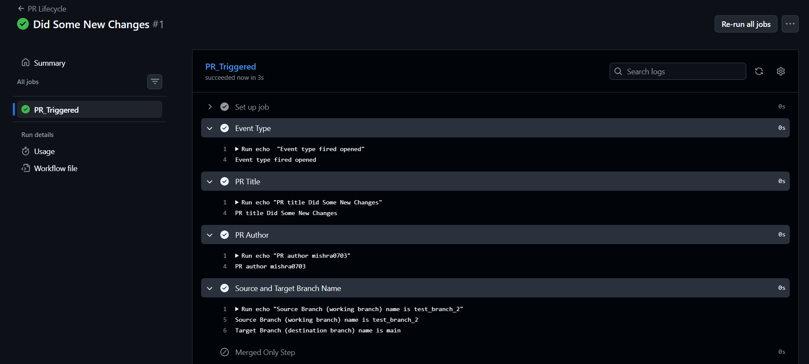
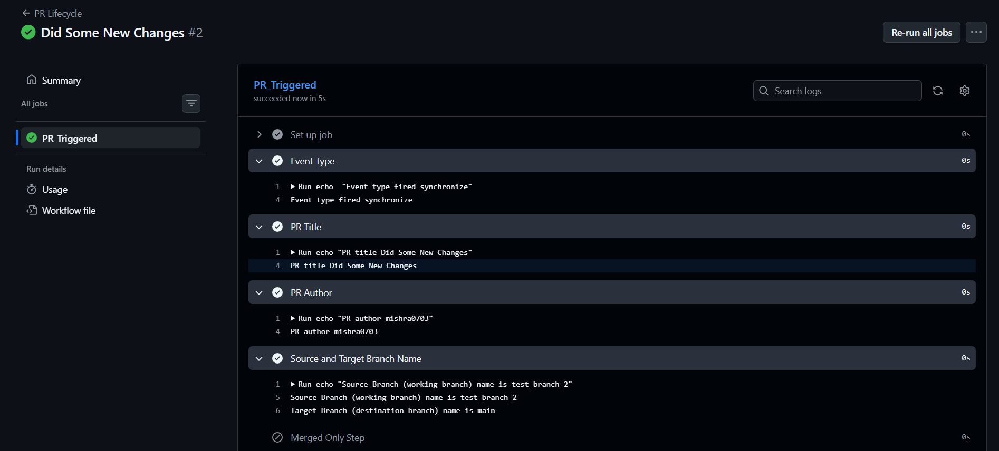
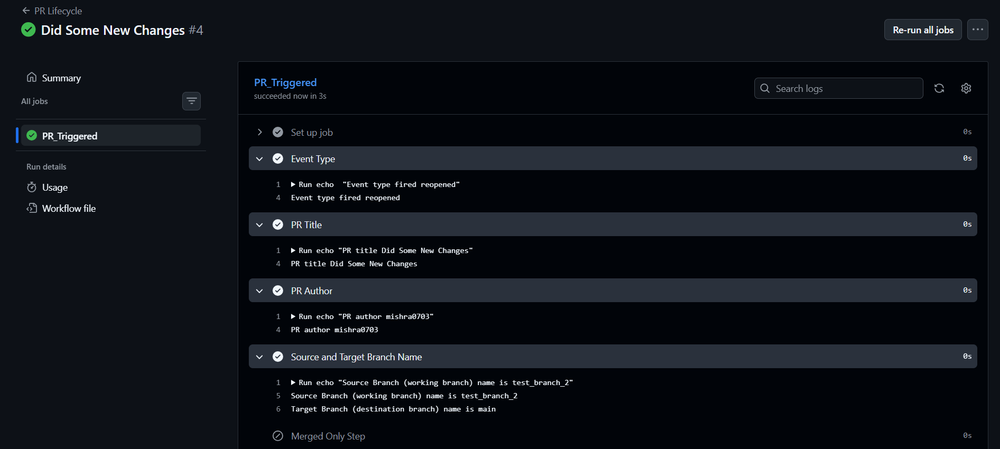
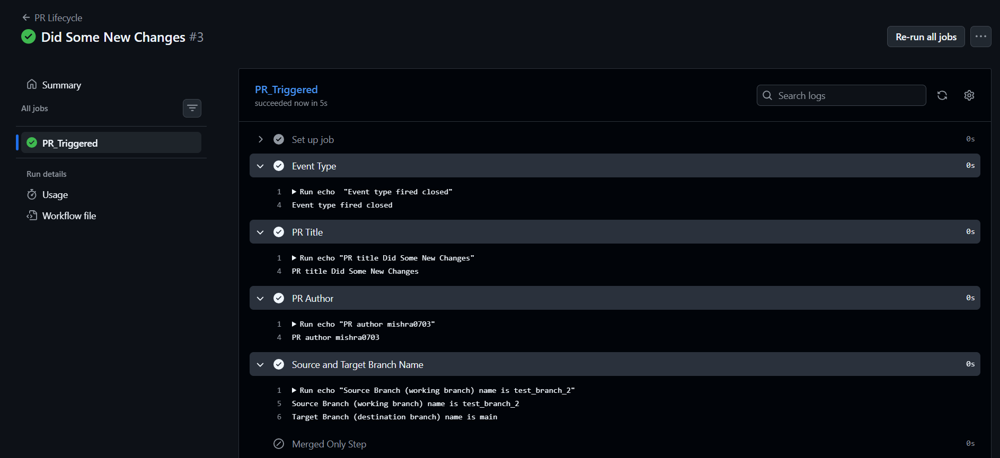
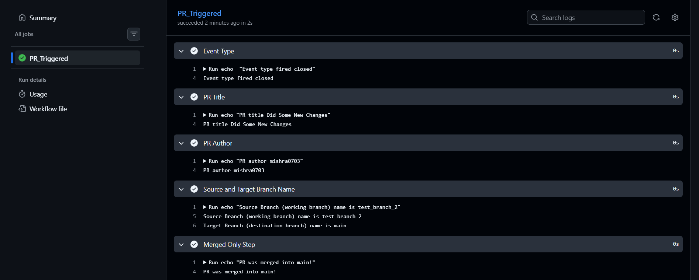

# Day 47 – Advanced Triggers: PR Events, Cron Schedules & Event-Driven Pipelines

## Task
We've used `push` and basic `pull_request` triggers. But GitHub Actions supports **dozens of event types** — today we will go deep into PR lifecycle events, scheduled cron jobs, and chaining workflows together.

---

## Pull Request Event Types

Create `.github/workflows/pr-lifecycle.yml` that triggers on `pull_request` with **specific activity types**:
1. Trigger on: `opened`, `synchronize`, `reopened`, `closed`
2. Add steps that:
   - Print which event type fired: `${{ github.event.action }}`
   - Print the PR title: `${{ github.event.pull_request.title }}`
   - Print the PR author: `${{ github.event.pull_request.user.login }}`
   - Print the source branch and target branch
3. Add a conditional step that only runs when the PR is **merged** (closed + merged = true)

Test it: create a PR, push an update to it, then merge it. Watch the workflow fire each time with a different event type.








---

## PR Validation Workflow

Create `.github/workflows/pr-checks.yml` — a real-world PR gate:
1. Trigger on `pull_request` to `main`
2. Add a job `file-size-check` that:
   - Checks out the code
   - Fails if any file in the PR is larger than 1 MB
3. Add a job `branch-name-check` that:
   - Reads the branch name from `${{ github.head_ref }}`
   - Fails if it doesn't follow the pattern `feature/*`, `fix/*`, or `docs/*`
4. Add a job `pr-body-check` that:
   - Reads the PR body: `${{ github.event.pull_request.body }}`
   - Warns (but doesn't fail) if the PR description is empty


---

## Scheduled Workflows (Cron Deep Dive)

Create `.github/workflows/scheduled-tasks.yml`:
1. Add a `schedule` trigger with cron: `'30 2 * * 1'` (every Monday at 2:30 AM UTC)
2. Add **another** cron entry: `'0 */6 * * *'` (every 6 hours)
3. In the job, print which schedule triggered using `${{ github.event.schedule }}`
4. Add a step that acts as a **health check** — curl a URL and check the response code  


- The cron expression for: every weekday at 9 AM IST
    - `'0 9 * * 1-5'`
- The cron expression for: first day of every month at midnight
    - `'0 0 1 * *'`
- Why GitHub says scheduled workflows may be delayed or skipped on inactive repos
    - GitHub delays or skips scheduled workflows on inactive repositories `to optimize server capacity` and `prevent resource waste`. Because GitHub Actions manages millions of global automation requests, the platform imposes structural limits on automated tasks that no longer have human oversight.


---
---

## Path & Branch Filters

Create `.github/workflows/smart-triggers.yml`:
1. Trigger on push but **only** when files in `src/` or `app/` change:
   ```yaml
   on:
     push:
       paths:
         - 'src/**'
         - 'app/**'
   ```
2. Add `paths-ignore` in a second workflow that skips runs when only docs change:
   ```yaml
   paths-ignore:
     - '*.md'
     - 'docs/**'
   ```
3. Add branch filters to only trigger on `main` and `release/*` branches
4. Test it: push a change to a `.md` file — does the workflow skip?


.png)


### When would you use `paths` vs `paths-ignore`?

#### We should Use paths 
- when we want to target specific files or directories for testing or deployment
- Targeting source code: Run tests only when files in the src/ directory change
- Frontend-only builds: Trigger a UI deployment only when files inside frontend/ are updated
- Specific file extensions: Run a linter only when .js or .ts files are modified


*Note : **Path filters use glob patterns — `**` matches nested directories***


#### We should Use paths-ignore 
- when changes to certain files do not impact your build, tests, or application logic.
- Documentation updates: Prevent workflows from running when someone only edits README.md or the docs/ folder
- Config file tweaks: Skip CI runs for updates to .gitignore or .prettierrc
- Administrative tasks: Ignore changes to internal markdown checklists or contributor logs


---

## `workflow_run` — Chain Workflows Together

Create two workflows:
1. `.github/workflows/tests.yml` — runs tests on every push
2. `.github/workflows/deploy-after-tests.yml` — triggers **only after** `tests.yml` completes successfully: 
   ```yaml
   on:
     workflow_run:
       workflows: ["Run Tests"]
       types: [completed]
   ```
3. In the deploy workflow, add a conditional:
   - Only proceed if the triggering workflow **succeeded** (`${{ github.event.workflow_run.conclusion == 'success' }}`)
   - Print a warning and exit if it failed


---

## `repository_dispatch` — External Event Triggers

1. Create `.github/workflows/external-trigger.yml` with trigger `repository_dispatch`
2. Set it to respond to event type: `deploy-request`
3. Print the client payload: `${{ github.event.client_payload.environment }}`
4. Trigger it using `curl` or `gh`:
   ```bash
   gh api repos/<owner>/<repo>/dispatches \
     -f event_type=deploy-request \
     -f client_payload='{"environment":"production"}'
   ```

*In point no. 4 the command got change a lil bit , it is now :*   
```bash
gh api \
  --method POST \
  -H "Accept: application/vnd.github+json" \
  -H "X-GitHub-Api-Version: 2026-03-10" \
  /repos/mishra0703/githubActions/dispatches \
   -f 'event_type=deploy-request' -F "client_payload[environment]=production"
```


### When would an external system (like a Slack bot or monitoring tool) trigger a pipeline?

- `Slack bot` — A team member types /deploy production in Slack → Slack bot receives the command → bot calls GitHub's API to fire repository_dispatch → deploy workflow runs, with the environment passed via client_payload.

- `Monitoring/alerting tool (e.g. Datadog, Prometheus Alertmanager)` — Detects an anomaly (high error rate, service down) → calls GitHub API → triggers an incident-response or rollback workflow automatically, no human needed to open GitHub.

- `External CI/CD or upstream repo` — A dependency repo finishes its own build → dispatches an event to downstream repos to trigger their rebuild/retest, keeping multi-repo pipelines in sync.

- `Third-party approval systems` — For example a change gets approved in an external ticketing tool (Jira, ServiceNow) → that approval triggers the actual deploy workflow in GitHub, keeping "permission to deploy" outside GitHub's own permission model.

- `Cron/scheduler outside GitHub` — Some orgs run their own internal scheduler (rather than GitHub's schedule trigger) for tighter control/logging, and that scheduler dispatches to GitHub when it's time to run.


*Core idea for repository_dispatch to use is to used it whenever the decision to run the pipeline is made by a system outside GitHub, rather than by something happening inside the repo (push, PR, schedule)*


