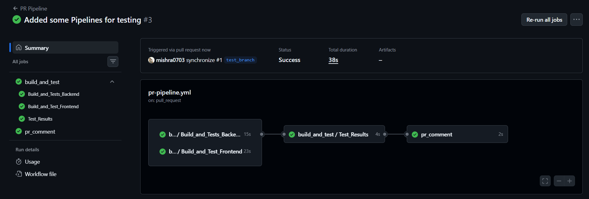
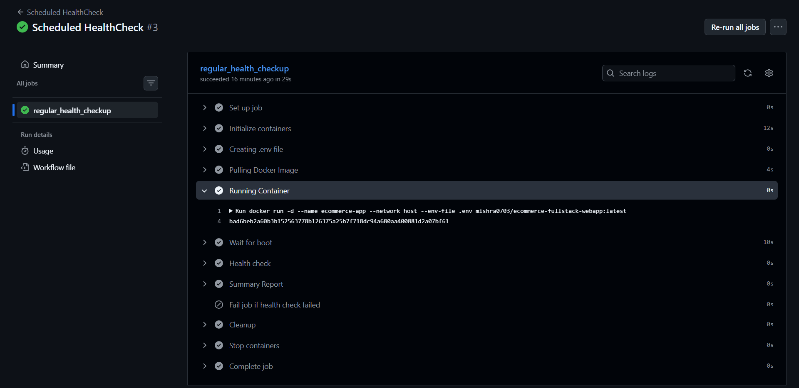

# Day 48 – GitHub Actions Project: End-to-End CI/CD Pipeline

## Task
We've learned workflows, triggers, secrets, Docker builds, reusable workflows, and advanced events. Today we will **put it all together** in one project — a complete, production-style CI/CD pipeline that builds, tests, and deploys using everything we've learned from Day 40 to Day 47.

This is our GitHub Actions capstone.

---

4. Add a `README.md` with a project description

---

## Reusable Workflow — Build & Test

Create `.github/workflows/reusable-build-test.yml`:
1. Trigger: `workflow_call`
2. Inputs: `python_version` (or `node_version`), `run_tests` (boolean, default: true)
3. Steps:
   - Check out code
   - Set up the language runtime
   - Install dependencies
   - Run tests (only if `run_tests` is true)
   - Set output: `test_result` with value `passed` or `failed`

This workflow does NOT deploy — it only builds and tests.

---

## Reusable Workflow — Docker Build & Push

Create `.github/workflows/reusable-docker.yml`:
1. Trigger: `workflow_call`
2. Inputs: `image_name` (string), `tag` (string)
3. Secrets: `docker_username`, `docker_token`   
4. Steps:
   - Check out code
   - Log in to Docker Hub
   - Build and push the image with the given tag
   - Set output: `image_url` with the full image path

---

## PR Pipel7ine

Create `.github/workflows/pr-pipeline.yml`:
1. Trigger: `pull_request` to `main` (types: `opened`, `synchronize`)
2. Call the reusable build-test workflow:
   - Run tests: `true`
3. Add a standalone job `pr-comment` that:
   - Runs after the build-test job
   - Prints a summary: "PR checks passed for branch: `<branch>`"
4. Do **NOT** build or push Docker images on PRs


---

---


---

## Main Branch Pipeline

Create `.github/workflows/main-pipeline.yml`:
1. Trigger: `push` to `main`
2. Job 1: Call the reusable build-test workflow
3. Job 2 (depends on Job 1): Call the reusable Docker workflow
   - Tag: `latest` and `sha-<short-commit-hash>`
4. Job 3 (depends on Job 2): `deploy` job that:
   - Prints "Deploying image: `<image_url>` to production"
   - Uses `environment: production` (set this up in repo Settings → Environments)
   - Requires manual approval if you've set up environment protection rules


---

---

---

---

---


---

## Scheduled Health Check

Create `.github/workflows/health-check.yml`:
1. Trigger: `schedule` with cron `'0 */12 * * *'` (every 12 hours) + `workflow_dispatch` for manual testing
2. Steps:
   - Pull your latest Docker image
   - Run the container in detached mode
   - Wait 5 seconds, then curl the health endpoint
   - Print pass/fail based on the response
   - Stop and remove the container
3. Add a step that creates a summary using `$GITHUB_STEP_SUMMARY`:
   ```bash
   echo "## Health Check Report" >> $GITHUB_STEP_SUMMARY
   echo "- Image: myapp:latest" >> $GITHUB_STEP_SUMMARY
   echo "- Status: PASSED" >> $GITHUB_STEP_SUMMARY
   echo "- Time: $(date)" >> $GITHUB_STEP_SUMMARY
   ```

---

---

---


---

## Add Badges & Documentation

1. Add status badges for all your workflows to the repo `README.md`
2. Add a **pipeline architecture diagram** in your notes — draw (or describe) the flow:
   ```
   PR opened → build & test → PR checks pass
   Merge to main → build & test → Docker build & push → deploy
   Every 12 hours → health check
   ```


---
### Badges

PR Pipeline
[](https://github.com/mishra0703/dockerized-fullstack-ecommerce-app/actions/workflows/pr-pipeline.yml)

CI Main Pipeline
[](https://github.com/mishra0703/dockerized-fullstack-ecommerce-app/actions/workflows/main-pipeline.yml)


Scheduled Health Check
[](https://github.com/mishra0703/dockerized-fullstack-ecommerce-app/actions/workflows/health-check.yml)


---

## Brownie Points: Add Security to Your Pipeline

Want to go above and beyond? Add a **DevSecOps** step to your main pipeline:
1. Add `aquasecurity/trivy-action` after the Docker build step to scan your image for vulnerabilities
2. Fail the pipeline if any **CRITICAL** severity CVE is found
3. Upload the scan report as an artifact

---

---


---
---

*Docker Hub Link for Image :*  
https://hub.docker.com/r/mishra0703/ecommerce-fullstack-webapp


*One More way to short SHA*
- Short SHA for tags: `$(echo ${{ github.sha }} | cut -c1-7)`
