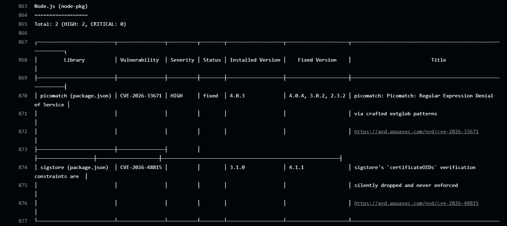

# Day 49 – DevSecOps: Add Security to Your CI/CD Pipeline

## Task
We can build and deploy automatically. But what if our Docker image has a known vulnerability? What if someone accidentally commits a password? Today we learn **DevSecOps** — adding simple, automated security checks to our pipeline so problems are caught **before** they reach production.


---

## What is DevSecOps?

Think of it like this:

**Without DevSecOps:**
> You build the app → deploy it → a security team finds a vulnerability weeks later → you scramble to fix it

**With DevSecOps:**
> You open a PR → the pipeline automatically checks for vulnerabilities → you fix it before it ever gets merged

**That's it.** DevSecOps = adding security checks to the pipeline you already have. Not a separate process — just a few extra steps.

---

## Key Principles (Keep These in Mind)

1. **Catch problems early** — A vulnerability found in a PR takes 5 minutes to fix. The same vulnerability found in production takes days.

2. **Automate the checks** — Don't rely on someone remembering to check. Let the pipeline do it every time.

3. **Block on critical issues** — If a scan finds a serious vulnerability, the pipeline should fail — just like a failing test.

4. **Never put secrets in code** — Use GitHub Secrets (you learned this on Day 44). No `.env` files, no hardcoded API keys.

5. **Give only the access needed** — Your workflow doesn't need write access to everything. Limit permissions.

---

## Scanning Docker Image for Vulnerabilities

Docker image might use a base image with known security issues. Let's find out.

Adding this step to our main branch pipeline (after Docker build, before deploy):
```yaml
- name: Scan Docker Image for Vulnerabilities
  uses: aquasecurity/trivy-action@master
  with:
    image-ref: 'your-username/your-app:latest'
    format: 'table'
    exit-code: '1'
    severity: 'CRITICAL,HIGH'
```

What this does:
- `trivy` scans your Docker image for known CVEs (Common Vulnerabilities and Exposures)
- `format: 'table'` prints a readable table in the logs
- `exit-code: '1'` means **fail the pipeline** if CRITICAL or HIGH vulnerabilities are found
- If it passes, your image is clean — proceed to push and deploy


### Notes

CVEs I got , that failed my pipeline 
- CVE-2026-33671 (HIGH)
- CVE-2026-48815

Both CVEs were flagged under Node.js (node-pkg) in the Trivy report — meaning they came from application dependencies (npm packages baked into the image), not from OS-level packages in the Alpine base itself. This confirms node:22-alpine is a reasonably clean base image; the vulnerabilities were in the JavaScript dependency tree, not the underlying Linux packages.

---



---

## Enable GitHub's Built-in Secret Scanning

GitHub can automatically detect if someone pushes a secret (API key, token, password) to your repo.

1. Go to your repo → Settings → **Code security and analysis**
2. Enable **Secret scanning**
3. If available, also enable **Push protection** — this blocks the push entirely if a secret is detected


### Notes

- What is the difference between secret scanning and push protection?

Secret scanning is a detective control that alerts you to secrets and credentials that have already been committed to your codebase. Push protection is a preventative control that actively blocks commits or pushes from occurring if they contain identifiable secrets, preventing the leak before it happens.

---


---

- What happens if GitHub detects a leaked AWS key in your repo?

When GitHub detects a leaked AWS key in our repository, it initiates a high-speed, automated chain reaction involving GitHub's Secret Scanning, Amazon Web Services (AWS), and malicious scanning bots.

Because public GitHub commits are monitored in real-time by both security systems and malicious actors, the entire detection and defense process unfolds within seconds.


---

## Scan Dependencies for Known Vulnerabilities

If your app uses packages (pip, npm, etc.), those packages might have known vulnerabilities.

Add this to your **PR pipeline** (not the main pipeline):
```yaml
- name: Check Dependencies for Vulnerabilities
  uses: actions/dependency-review-action@v4
  with:
    fail-on-severity: critical
```

---


---

## Add Permissions to Your Workflows

By default, workflows get broad permissions. Lock them down.

Add this block near the top of your workflow files (after `on:`):
```yaml
permissions:
  contents: read
```

If a workflow needs to comment on PRs, add:
```yaml
permissions:
  contents: read
  pull-requests: write
```

Write in your notes: Why is it a good practice to limit workflow permissions? What could go wrong if a compromised action has write access to your repo?


---


---

## See the Full Secure Pipeline

Look at what your pipeline does now:

```
PR opened
  → build & test
  → dependency vulnerability check     ← NEW (Day 49)
  → PR checks pass or fail

Merge to main
  → build & test
  → Docker build
  → Trivy image scan (fail on CRITICAL) ← NEW (Day 49)
  → Docker push (only if scan passes)
  → deploy

Always active
  → GitHub secret scanning              ← NEW (Day 49)
  → push protection for secrets         ← NEW (Day 49)
```


---


---

## Brownie Points (Optional — For the Curious)

*I Will use these tips in future projects*

### Upload Scan Results to GitHub Security Tab

Add SARIF output to Trivy and upload it — your scan results will appear in the repo's **Security** tab:
```yaml
- uses: aquasecurity/trivy-action@master
  with:
    image-ref: 'your-username/your-app:latest'
    format: 'sarif'
    output: 'trivy-results.sarif'
- uses: github/codeql-action/upload-sarif@v3
  with:
    sarif_file: 'trivy-results.sarif'
```

### Learn About OIDC (Keyless Authentication)
Instead of storing cloud credentials as long-lived secrets, GitHub Actions can use OIDC to get short-lived tokens automatically. Research: "GitHub Actions OIDC" — it's how production pipelines authenticate to AWS, GCP, and Azure without storing any keys.

