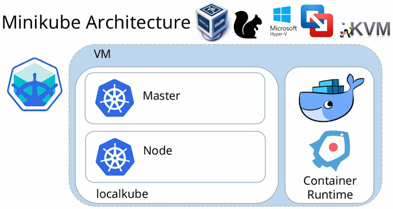

# Day 50 – Kubernetes Architecture and Cluster Setup

## Task
We have been building and shipping containers with Docker. But what happens when we need to run hundreds of containers across multiple servers? We need an orchestrator. Today we will start our Kubernetes journey — understand the architecture, set up a local cluster, and run our first `kubectl` commands.

---

## Recall the Kubernetes Story

1. Why was Kubernetes created? What problem does it solve that Docker alone cannot?
- Docker runs containers on a single host, but doesn't handle scaling, self-healing, load balancing, or scheduling across multiple machines. Kubernetes automates deployment, scaling, networking, and recovery of containers across a cluster of hosts — turning many machines into one manageable system.

2. Who created Kubernetes and what was it inspired by?
- Created by Google, based on their internal system called Borg (used to manage Google's massive container workloads for 10+ years). K8s Released as open-source in 2014, which is now maintained by CNCF.

3. What does the name "Kubernetes" mean?
- Greek for "helmsman" / "pilot" (one who steers a ship) — hence the wheel-like logo.


---

## Draw the Kubernetes Architecture

**Control Plane (Master Node):**
- API Server — the front door to the cluster, every command goes through it
- etcd — the database that stores all cluster state
- Scheduler — decides which node a new pod should run on
- Controller Manager — watches the cluster and makes sure the desired state matches reality

**Worker Node:**
- kubelet — the agent on each node that talks to the API server and manages pods
- kube-proxy — handles networking rules so pods can communicate
- Container Runtime — the engine that actually runs containers (containerd, CRI-O)


---

- What happens when you run `kubectl apply -f pod.yaml`? Trace the request through each component.
    - kubectl sends the YAML as a request to the API Server, which authenticates/validates it and stores the desired state in etcd. The Scheduler picks a suitable node, then the kubelet on that node talks to the container runtime to pull the image and start the pod, reporting status back to the API server.

- What happens if the API server goes down?
    - No new kubectl commands work (can't create/update/delete/view resources), and components can't communicate via the control plane. But already-running pods keep running — kubelets continue managing them locally until the API server is back.

- What happens if a worker node goes down?
    - The node's kubelet stops sending statuses of pods, so after a timeout the Controller Manager marks it Not-Ready. Pods on that node are eventually rescheduled onto healthy nodes (if managed by a Deployment/ReplicaSet).

---


---

## Install kubectl

`kubectl` is the CLI tool you will use to talk to your Kubernetes cluster.

Install it:
```bash

# Linux (amd64)
curl -LO "https://dl.k8s.io/release/$(curl -L -s https://dl.k8s.io/release/stable.txt)/bin/linux/amd64/kubectl"
chmod +x kubectl
sudo mv kubectl /usr/local/bin/

# Windows (with chocolatey)
choco install kubernetes-cli

```

Verify:
```bash
kubectl version --client
```

---

## Set Up Your Local Cluster

### **Option A: kind (Kubernetes in Docker)**

```bash
# Install kind on Linux
curl -Lo ./kind https://kind.sigs.k8s.io/dl/latest/kind-linux-amd64
chmod +x ./kind
sudo mv ./kind /usr/local/bin/kind

# Create a cluster
kind create cluster --name devops-cluster

# Verify
kubectl cluster-info
kubectl get nodes
```


### **Option B: minikube**

```bash
# Install minikube on Windows
Follow this only : `https://github.com/LondheShubham153/kubestarter/blob/main/Minikube_Windows_Installation.md`

# Linux
curl -LO https://storage.googleapis.com/minikube/releases/latest/minikube-linux-amd64
sudo install minikube-linux-amd64 /usr/local/bin/minikube

# Start a cluster
minikube start

# Verify
kubectl cluster-info
kubectl get nodes
```


### *Note :*
Minikube is an open-source tool that lets us run a lightweight Kubernetes cluster on our local machine. It creates a `single-node cluster inside a virtual machine (VM)` or container on your PC, making it the perfect sandbox for learning Kubernetes commands, debugging apps, and testing deployments without needing cloud infrastructure.



---

## Explore Your Cluster

```bash
# See cluster info
kubectl cluster-info

# List all nodes
kubectl get nodes

# Get detailed info about your node
kubectl describe node <node-name>

# List all namespaces
kubectl get namespaces

# See ALL pods running in the cluster (across all namespaces)
kubectl get pods -A

#Look at the pods running in the `kube-system` namespace:
kubectl get pods -n kube-system
```
*Note :* `kubectl get pods -A` is short for `kubectl get pods --all-namespaces`


### Using minikube


### Using KIND


---

## Practice Cluster Lifecycle

```bash
# Delete your cluster
kind delete cluster --name devops-cluster
# (or: minikube delete)

# Recreate it
kind create cluster --name devops-cluster
# (or: minikube start)

# Verify it is back
kubectl get nodes
```

### Useful commands:

```bash
# Check which cluster kubectl is connected to
kubectl config current-context

# List all available contexts (clusters)
kubectl config get-contexts

# See the full kubeconfig
kubectl config view
```

### kubectl config Outputs : 


#### What is a kubeconfig? Where is it stored on your machine?
- A kubeconfig file stores cluster connection details — API server address, credentials (certs/tokens), and contexts (cluster + user + namespace combos) — that kubectl uses to know which cluster to talk to and how to authenticate.


---