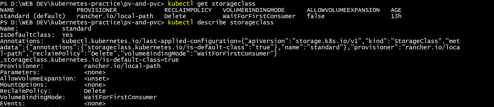

# Day 55 – Persistent Volumes (PV) and Persistent Volume Claims (PVC)

## Task
Containers are ephemeral — when a Pod dies, everything inside it disappears. That is a serious problem for databases and anything that needs to survive a restart. Today we will fix this with Persistent Volumes and Persistent Volume Claims.

---

## See the Problem — Data Lost on Pod Deletion

1. Write a Pod manifest that uses an `emptyDir` volume and writes a timestamped message to `/data/message.txt`
2. Apply it, verify the data exists with `kubectl exec`
3. Delete the Pod, recreate it, check the file again — the old message is gone

---

---
---

## Create a PersistentVolume (Static Provisioning)

1. Write a PV manifest with `capacity: 1Gi`, `accessModes: ReadWriteOnce`, `persistentVolumeReclaimPolicy: Retain`, and `hostPath` pointing to `/tmp/k8s-pv-data`
2. Apply it and check `kubectl get pv` — status should be `Available`

Access modes to know:
- `ReadWriteOnce (RWO)` — read-write by a single node
- `ReadOnlyMany (ROX)` — read-only by many nodes
- `ReadWriteMany (RWX)` — read-write by many nodes

`hostPath` is fine for learning, not for production.

---

---
---

## Create a PersistentVolumeClaim

1. Write a PVC manifest requesting `500Mi` of storage with `ReadWriteOnce` access
2. Apply it and check both `kubectl get pvc` and `kubectl get pv`
3. Both should show `Bound` — Kubernetes matched them by capacity and access mode

---

---
---

## Use the PVC in a Pod — Data That Survives

1. Write a Pod manifest that mounts the PVC at `/data` using `persistentVolumeClaim.claimName`
2. Write data to `/data/message.txt`, then delete and recreate the Pod
3. Check the file — it should contain data from both Pods

---

---
---

## StorageClasses and Dynamic Provisioning

1. Run `kubectl get storageclass` and `kubectl describe storageclass`
2. Note the provisioner, reclaim policy, and volume binding mode
3. With dynamic provisioning, developers only create PVCs — the StorageClass handles PV creation automatically

- With a StorageClass, we'd skip that step entirely — just create a PVC referencing storageClassName: standard (or omit it, since it's default), and Kubernetes/the provisioner automatically creates a matching PV behind the scenes. 
- This is how storage actually works in real cloud clusters (e.g., AWS EBS, GCP Persistent Disks) — We never hand-write PVs.

---

---
---

## Dynamic Provisioning

1. Write a PVC manifest that includes `storageClassName: standard` (or your cluster's default)

2. Apply it — a PV should appear automatically in `kubectl get pv`
---

---

3. Use this PVC in a Pod, write data, verify it works
---

---
---

## Clean Up

1. Delete all pods first

2. Delete PVCs — check `kubectl get pv` to see what happened
---

---

3. The dynamic PV is gone (Delete reclaim policy). The manual PV shows `Released` (Retain policy).
---

---

4. Delete the remaining PV manually

---

## *Points to Remember*

- PVs are cluster-wide (not namespaced), PVCs are namespaced
- PV status: `Available` -> `Bound` -> `Released`
- If a PVC stays `Pending`, check for matching capacity and access modes
- `hostPath` data is lost if the Pod moves to a different node
- `storageClassName: ""` disables dynamic provisioning
- Reclaim policies: `Retain` (keep data) vs `Delete` (remove data)

