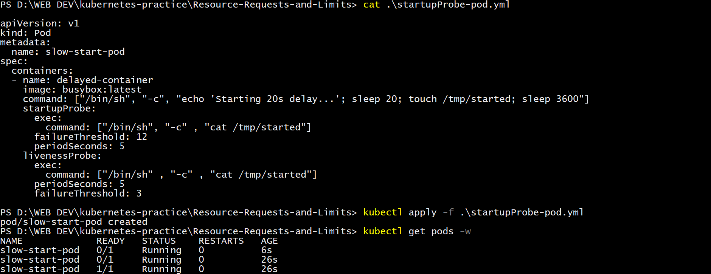

# Day 57 – Resource Requests, Limits, and Probes

## Task
Our Pods are running, but Kubernetes has no idea how much CPU or memory they need — and no way to tell if they are actually healthy. Today we will set resource requests and limits for smart scheduling, then add probes so Kubernetes can detect and recover from failures automatically.

---

## Resource Requests and Limits

1. Write a Pod manifest with `resources.requests` (cpu: 100m, memory: 128Mi) and `resources.limits` (cpu: 250m, memory: 256Mi)

2. Apply and inspect with `kubectl describe pod` — look for the Requests, Limits, and QoS Class sections
---

---

---

3. Since requests and limits differ, the QoS class is `Burstable`. If equal, it would be `Guaranteed`. If missing, `BestEffort`.
---

---

---
### When requests and limits are missing
---

---

### *Points to Remember*

- CPU is in millicores: `100m` = 0.1 CPU. Memory is in mebibytes: `128Mi`.

- **Requests** = guaranteed minimum (scheduler uses this for placement). 
- **Limits** = maximum allowed (kubelet enforces at runtime).

---

## OOMKilled — Exceeding Memory Limits

1. Write a Pod manifest using the `polinux/stress` image with a memory limit of `100Mi`

2. Set the stress command to allocate 200M of memory: `command: ["stress"] args: ["--vm", "1", "--vm-bytes", "200M", "--vm-hang", "1"]`
---

---

3. Apply and watch — the container gets killed immediately

- CPU is throttled when over limit. Memory is killed — no mercy.

- Check `kubectl describe pod` for `Reason: OOMKilled` and `Exit Code: 137` (128 + SIGKILL).
    
    ---
    
    ---

---

## Pending Pod — Requesting Too Much

1. Write a Pod manifest requesting `cpu: 100` and `memory: 128Gi`

2. Apply and check — STATUS stays `Pending` forever
----

----

3. Run `kubectl describe pod` and read the Events — the scheduler says exactly why: insufficient resources
---
.png)
---

- What event message does the scheduler produce?
    
    0/2 nodes are available: 1 Insufficient cpu, 1 node(s) had untolerated taint(s). no new claims to deallocate, preemption: 0/2 nodes are available: 2 Preemption is not helpful for scheduling.

    
---

## Liveness Probe

A liveness probe detects stuck containers. If it fails, Kubernetes restarts the container.

1. Write a Pod manifest with a busybox container that creates `/tmp/healthy` on startup, then deletes it after 30 seconds

2. Add a liveness probe using `exec` that runs `cat /tmp/healthy`, with `periodSeconds: 5` and `failureThreshold: 3`

3. After the file is deleted, 3 consecutive failures trigger a restart. Watch with `kubectl get pod -w`

---

---
---

## Readiness Probe

A readiness probe controls traffic. Failure removes the Pod from Service endpoints but does NOT restart it.

1. Write a Pod manifest with nginx and a `readinessProbe` using `httpGet` on path `/` port `80`
2. Expose it as a Service: `kubectl expose pod <name> --port=80 --name=readiness-svc`
3. Check `kubectl get endpoints readiness-svc` — the Pod IP is listed
4. Break the probe: `kubectl exec <pod> -- rm /usr/share/nginx/html/index.html`
5. Wait 15 seconds — Pod shows `0/1` READY, endpoints are empty, but the container is NOT restarted

---

---
---

## Startup Probe

A startup probe gives slow-starting containers extra time. While it runs, liveness and readiness probes are disabled.

1. Write a Pod manifest where the container takes 20 seconds to start (e.g., `sleep 20 && touch /tmp/started`)
2. Add a `startupProbe` checking for `/tmp/started` with `periodSeconds: 5` and `failureThreshold: 12` (60 second budget)
3. Add a `livenessProbe` that checks the same file — it only kicks in after startup succeeds

---

---

---

### *What would happen if `failureThreshold` were 2 instead of 12?*

- Budget = periodSeconds (5s) × failureThreshold (2) = only 10 seconds for the container to signal it's started.
- Since our container actually takes 20 seconds to touch /tmp/started, the startup probe would fail twice (at ~5s and ~10s) before the file ever gets created — hitting the failure threshold too early.
- Kubernetes would conclude the container failed to start properly and kill and restart it — triggering a CrashLoopBackOff.

*Point to remember*

**Key lesson :** `failureThreshold × periodSeconds` must always be `≥` `our container's actual worst-case startup time`, or the startup probe becomes counterproductive — punishing a healthy-but-slow container as if it were broken.

---

---
---

### *Points to Remember*

- CPU is compressible (throttled); memory is incompressible (OOMKilled)
- CPU: `1` = 1 core = `1000m`. Memory: `Mi` (mebibytes), `Gi` (gibibytes)
- QoS: 
    - Guaranteed (requests == limits)
    - Burstable (requests < limits) 
    - BestEffort (none set)
    
- Probe types: `httpGet`, `exec`, `tcpSocket`
- Liveness failure = restart. Readiness failure = remove from endpoints. Startup failure = kill.
- `initialDelaySeconds`, `periodSeconds`, `failureThreshold` control probe timing
- Exit code 137 = OOMKilled (128 + SIGKILL)

