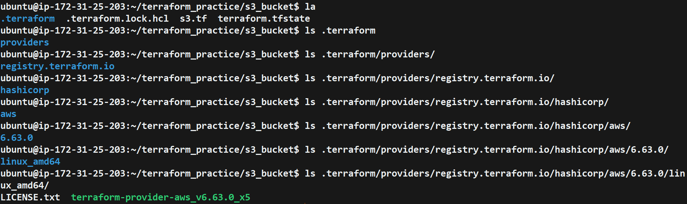

# Day 61 -- Introduction to Terraform and Your First AWS Infrastructure

## Task
We have been deploying containers, writing CI/CD pipelines, and orchestrating workloads on Kubernetes. But who creates the servers, networks, and clusters underneath? Today we start our Infrastructure as Code journey with Terraform -- the tool that lets us define, provision, and manage cloud infrastructure by writing code.

By the end of today, we will have created real AWS resources using nothing but a `.tf` file and a terminal.


---

## Understand Infrastructure as Code

1. What is Infrastructure as Code (IaC)? Why does it matter in DevOps?
- IaC means managing infrastructure (servers, networks, databases) using code/config files instead of manually clicking in a console. 
- It matters because it makes infra repeatable, version-controlled, and automatable — which becomes a key for fast, reliable DevOps workflows.


2. What problems does IaC solve compared to manually creating resources in the AWS console?
- Fast to recreate/scale infra
- Reduces human error from manual clicks
- Easy rollback if something breaks
- Showing a clear history of every change and who made it.


3. How is Terraform different from AWS CloudFormation, Ansible, and Pulumi?
- CloudFormation is AWS-only and hence it is built exclusively to manage resources within the Amazon Web Services.
- Terraform and Ansible are usually complementary, not competitors
- Ansible can also use for configuring and automating software on existing servers not just for infra provisioning.
- Pulumi is same as Terraform but it allows us to write our infrastructure code using real programming languages like Python, TypeScript, JavaScript , Java and Go instead of a special syntax.


4. What does it mean that Terraform is "declarative" and "cloud-agnostic"?
- Declarative means we only has to describe the end result we want (e.g., "I need 2 servers"), and Terraform figures out how to get there — we don't write step-by-step instructions.
- Cloud-agnostic means the same Terraform tool/language can manage infra across different cloud providers (AWS, Azure, GCP), not locked to one.


---

## Install Terraform and Configure AWS

1. Install Terraform:
```bash
# macOS
brew tap hashicorp/tap
brew install hashicorp/tap/terraform

# Linux (amd64)
wget -O - https://apt.releases.hashicorp.com/gpg | sudo gpg --dearmor -o /usr/share/keyrings/hashicorp-archive-keyring.gpg
echo "deb [signed-by=/usr/share/keyrings/hashicorp-archive-keyring.gpg] https://apt.releases.hashicorp.com $(lsb_release -cs) main" | sudo tee /etc/apt/sources.list.d/hashicorp.list
sudo apt update && sudo apt install terraform

# Windows
choco install terraform
```

2. Verify:
```bash
terraform -version
```

3. Install and configure the AWS CLI:
```bash
aws configure
# Enter your Access Key ID, Secret Access Key, default region (e.g., ap-south-1), output format (json)
```

4. Verify AWS access:
```bash
aws sts get-caller-identity
```

You should see your AWS account ID and ARN.
---

## Creating an S3 Bucket

Create a file called `main.tf` with:
1. A `terraform` block with `required_providers` specifying the `aws` provider
2. A `provider "aws"` block with your region
3. A `resource "aws_s3_bucket"` that creates a bucket with a globally unique name

Run the Terraform lifecycle:
```bash
terraform init      # Download the AWS provider
terraform plan      # Preview what will be created
terraform apply     # Create the bucket (type 'yes' to confirm)
```

---

---

---

### What did `terraform init` download?
- The provider plugins needed (e.g., AWS provider) based on our config
- Any modules we're referencing (local or remote)
- Sets up the backend for storing state (local or remote like S3)
---

---

### What does the `.terraform/` directory contain?
- Providers/ — the downloaded provider plugins (binaries)
- Module source code (if using modules)
- Backend config info
- Basically all the "setup files" Terraform needs to actually run — you don't edit this manually, and it's usually gitignored
---

---
---

## Creating an EC2 Instance

In the same `main.tf`, add:
1. A `resource "aws_instance"` using AMI `ami-0f5ee92e2d63afc18` (Amazon Linux 2 in ap-south-1 -- use the correct AMI for your region)
2. Set instance type to `t2.micro`
3. Add a tag: `Name = "TerraWeek-Day1"`

Run:
```bash
terraform plan      # You should see 1 resource to add (bucket already exists)
terraform apply
```
---

---


### How does Terraform know the S3 bucket already exists and only the EC2 instance needs to be created?
- Terraform checks its state file (terraform.tfstate). This file keeps a record of everything Terraform has already created and their current attributes.
- When we run terraform plan or apply, Terraform compares ----> 
    - Our config (what we want)
    - The state file (what terraform already created)
- If the S3 bucket is already listed in the state file and matches what's in the config, Terraform skips it.
- Since the EC2 instance isn't in the state file yet, Terraform knows it needs to create it.


---

---
---

## Understand the State File

Terraform tracks everything it creates in a state file. Time to inspect it.

1. Open `terraform.tfstate` in your editor -- read the JSON structure
2. Run these commands and document what each returns:
```bash
terraform show                          # Human-readable view of current state
terraform state list                    # List all resources Terraform manages
terraform state show aws_s3_bucket.<name>   # Detailed view of a specific resource
terraform state show aws_instance.<name>
```
---


---
```bash
# Command : terraform state list    (List all resources Terraform manages)
aws_instance.tf-test-instance
aws_s3_bucket.tf-created-bucket
```
---
.png)
---
.png)
---


### What information does the state file store about each resource?
- Resource type and name (e.g., aws_instance.web)
- All its attributes/values (ID, IP address, ARN, size, tags, etc.)
- Dependency info (what depends on what)
- Metadata Terraform needs to map your config to the real-world resource

### Why should you never manually edit the state file?
- It's easy to make a typo or mismatch that breaks the link between your config and real infra
- Terraform could think a resource doesn't exist (and try to recreate it) or already exists differently (causing errors/conflicts)
- Manual edits aren't validated — one mistake can corrupt the whole file, breaking future plans/applies

### Why should the state file not be committed to Git?
- It often contains sensitive data in plain text (passwords, keys, IPs, ARNs, DB credentials)
- If multiple people work on it, Git can cause conflicting versions (no proper locking) — leading to state corruption
- Best practice: store it remotely (e.g., S3 + DynamoDB for locking) so it's shared safely and stays out of version control

---

## Modify, Plan, and Destroy

1. Change the EC2 instance tag from `"TerraWeek-Day1"` to `"TerraWeek-Modified"` in your `main.tf`
2. Run `terraform plan` and read the output carefully:
   - What do the `~`, `+`, and `-` symbols mean?
   - Is this an in-place update or a destroy-and-recreate?
3. Apply the change
4. Verify the tag changed in the AWS console
5. Finally, destroy everything:

```bash
terraform destroy
```
6. Verify in the AWS console -- both the S3 bucket and EC2 instance should be gone

### What ~, +, - mean in terraform plan output:
- `~` : Resource will be updated in-place (modified, not destroyed)
- `+` : Resource (or attribute) will be created (new addition)
- `-` : Resource (or attribute) will be destroyed/removed
- `-/+` : Resource will be destroyed and recreated (destroy first, then create — happens when a change can't be applied in-place)

---

---

---

## *Points to Remember*
- S3 bucket names must be globally unique -- use something like `terraweek-<yourname>-2026`
- AMI IDs are region-specific -- search "Amazon Linux 2 AMI" in your region's EC2 launch wizard
- `terraform fmt` auto-formats your `.tf` files -- run it before committing
- `terraform validate` checks for syntax errors without connecting to AWS
- The `.terraform/` directory contains downloaded provider plugins
- Add `*.tfstate`, `*.tfstate.backup`, and `.terraform/` to your `.gitignore`

---
